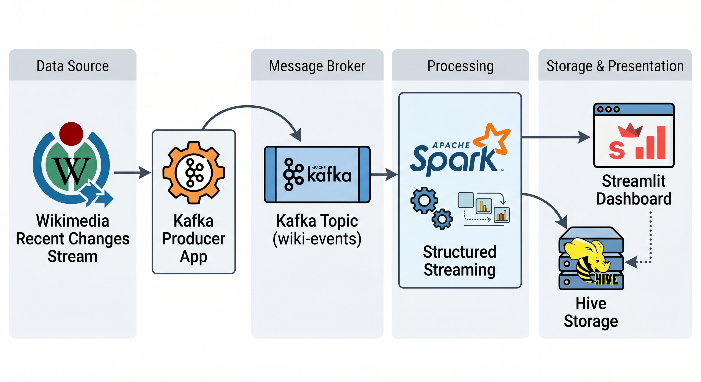

# Big Data Final Project

## Demo Video
🎥 [Project Demo Recording](screenshots/demo.mp4)

---

# Project Overview
This project implements an end-to-end real-time big data pipeline using Apache Kafka, Spark Structured Streaming, Hive Parquet storage, and a dynamic Streamlit dashboard.

## Project Architecture
Wikimedia Recent Changes Stream → Kafka Producer → Kafka Topic → Spark Structured Streaming → Hive-style Parquet Storage → Streamlit Dashboard



---

# Project Parts and Implementation

## Part 1 - Data Ingestion using Kafka
A real-time Kafka producer was implemented using Python. The producer connects to the Wikimedia Recent Changes live stream and continuously sends JSON events into the Kafka topic `wiki-events`.

## Part 2 - Distributed Processing using Spark Structured Streaming
Spark Structured Streaming consumes real-time Kafka events and performs analytics such as:
- Event count by wiki
- Bot vs Human activity analysis
- Event type aggregation
- Top active users
- High activity detection

## Part 3 - Persistent Storage using Hive-style Parquet Warehouse
Processed streaming outputs are stored in a persistent Parquet warehouse directory acting as a Hive-style storage layer.

## Part 4 - Dynamic Dashboard Visualization
A Streamlit dashboard visualizes real-time analytics including:
- Events by wiki
- Top active users
- Event type statistics
- Wiki activity status
- Events by language
- Events by category

## Part 5 - Spark SQL Static Dataset Join (Bonus)
A static dataset (`wiki_mapping.csv`) is joined with live streaming data to enrich analytics with language and category information.

---

# Technologies Used
- Docker
- Apache Kafka
- Apache Spark Structured Streaming
- Hive-style Parquet Storage
- Python
- Streamlit
- Spark SQL

---

# How to Run the Project

## Start Docker services
```bash
docker compose up -d
```

## Run Kafka Producer
```bash
docker exec -it spark python3 -u producer/producer.py
```

## Run Spark Structured Streaming
```bash
docker exec -u root -it spark /opt/spark/bin/spark-submit \
  --packages org.apache.spark:spark-sql-kafka-0-10_2.12:3.5.8 \
  spark/streaming.py
```

## Open Dashboard
http://localhost:8501

---

# Project Requirement Summary
This project successfully implements:
- Kafka ingestion
- Distributed Spark processing
- Persistent Hive-style storage
- Dynamic dashboard visualization
- Spark SQL enrichment with static datasets
